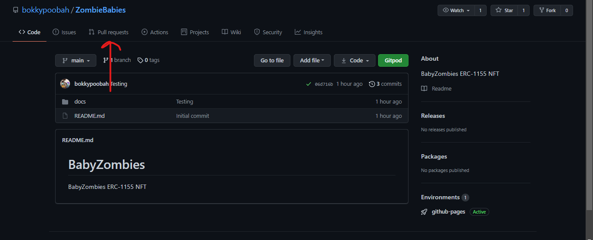
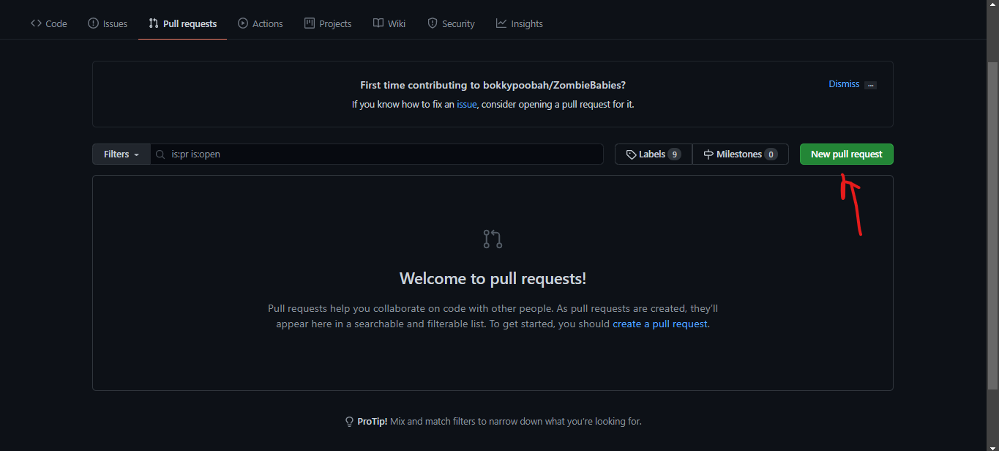
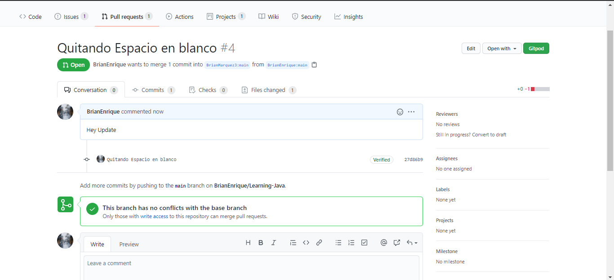
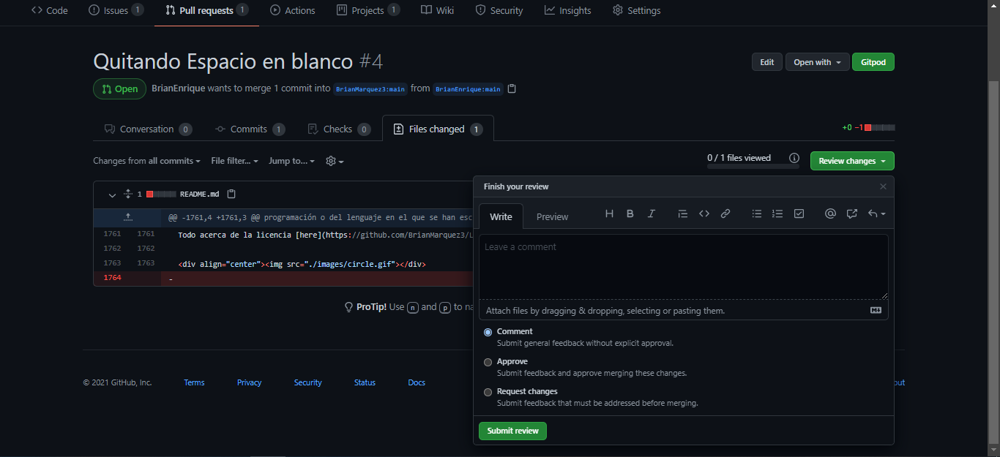

### Folk

- Ramificacion dE proyecto y calaboraciones

Una ramificación es una copia de un repositorio. Bifurcar un repositorio te permite experimentar libremente con cambios sin afectar el proyecto original.

Casi siempre las bifurcaciones se usan para proponer cambios al proyecto de otra persona o para usar el proyecto de otra persona como inicio de tu propia idea.

Proponer cambios para el proyecto de otra persona

Por ejemplo, puedes utilizar ramificaciones para proponer cambios relacionados con arreglar un error. En lugar de registrar una propuesta para un error que has encontrado, puedes hacer lo siguiente:

- Bifurcar el repositorio.
- Solucionar el problema.
- Submit a pull request to the project owner.

### Pull Request

- Luego de hacer un Folk para enviar cambios al creador del repositorio

<table align="center" >
  <tr>
    <td align="center" style="padding=0;width=50%;">
      
    </td>
  </tr>
</table>

<table align="center" >
  <tr>
    <td align="center" style="padding=0;width=50%;">
      
    </td>
  </tr>
</table>

### 2 Cuentas en las misma pc

Borrar las credeciales para cambiar la cuenta en github

<table align="center" >
  <tr>
    <td align="center" style="padding=0;width=50%;">
      
    </td>
  </tr>
</table>

## Folk and Merge

<table align="center" >
  <tr>
    <td align="center" style="padding=0;width=50%;">
      
    </td>
  </tr>
</table>

<table align="center" >
  <tr>
    <td align="center" style="padding=0;width=50%;">
      
    </td>
  </tr>
</table>

<table align="center" >
  <tr>
    <td align="center" style="padding=0;width=50%;">
      
    </td>
  </tr>
</table>

<table align="center" >
  <tr>
    <td align="center" style="padding=0;width=50%;">
      
    </td>
  </tr>
</table>