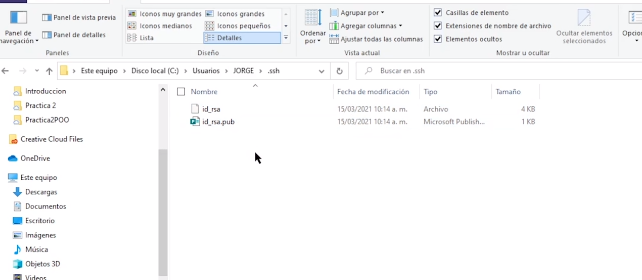

### SSH

Crear de claves puplicas y privadas

_ir a home_

```
pwd
```

_crear llaves SSH_

```
ssh-keygen -t rsa -b 4096 -C "brian3marquez@gmail.com"
```
- la llave se guardaria en la msma capeta pro defecto c/usuarios/brian/...

- Coloca un Password si se desea

<table align="center" >
  <tr>
    <td align="center" style="padding=0;width=50%;">
      
    </td>
  </tr>
</table>