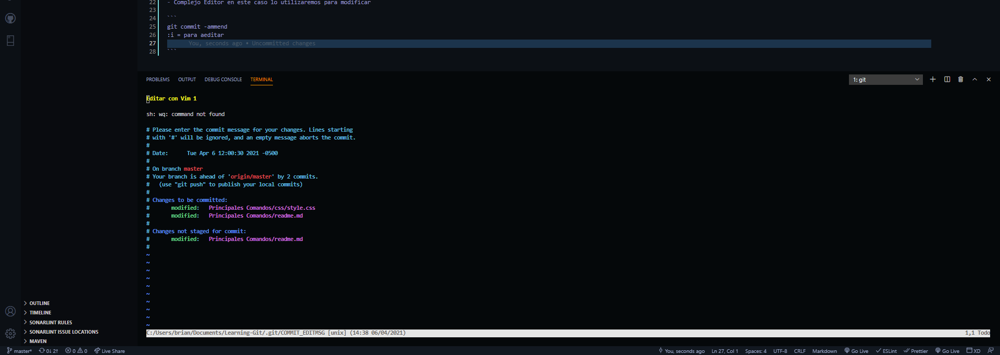
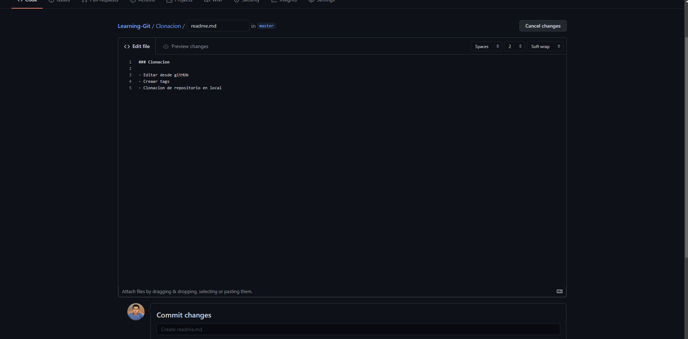
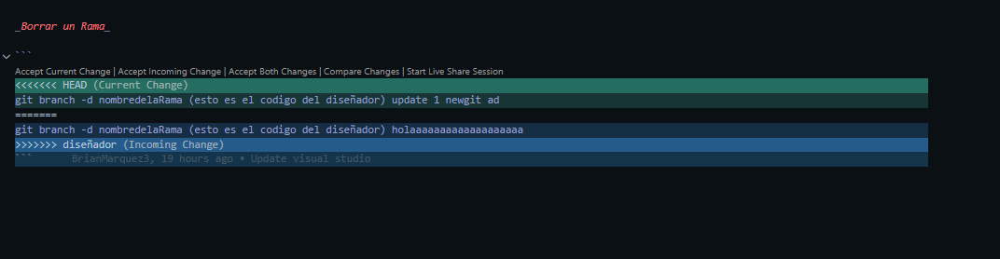

<h2 align="center">Learning Git/GitHub</h2>

<p align="center">
  
   </a>
    
  </a>
  <a href="https://github.com/BrianMarquez3/Learning-Git/stargazers">
    
  </a>
  <a href="https://github.com/BrianMarquez3/Python-Course/network">
    
  </a>
    
  </a>
  
  </a>
    
  </a>
  
  </a>
    
  </a>
  
   </a>
   <a href="https://github.com/BrianMarquez3/Learning-Git/network">
    
  </a><br>
 
  
  
  
</p>
  
<table>
  <tr>
    <td align="center" style="padding=0;width=50%;">
      
    </td>
  </tr>
</table>

## ¿Que es Git?
es un software de control de versiones diseñado por Linus Torvalds, pensando en la eficiencia y la confiabilidad del mantenimiento de versiones de aplicaciones cuando éstas tienen un gran número de archivos de código fuente. Su propósito es llevar registro de los cambios en archivos de computadora y coordinar el trabajo que varias personas realizan sobre archivos compartidos. [WIKIPEDIA](https://es.wikipedia.org/wiki/Git).<br>

## Tabla de contenidos

| Numeration   | Check  |    Topic      |   Quantization   |    Edit Gitpot    |    Downloads    |  link  |
| ------------ |--------|-------------- |----------------- |------------------ |---------------- |-------- |
|  001   |:heavy_check_mark: | [Instalacion](#Instalacion)   | :hourglass:     | 💻 | 💾 | [ ⬅️ Atras](https://github.com/BrianMarquez3)| 
|  002   |:heavy_check_mark: | [Comandos](#Comandos)   | :hourglass:     | 💻 | 💾 | [ ⬅️ Atras](https://github.com/BrianMarquez3)| 
|  003   |:heavy_check_mark: | [Crear repositorio](#Crear-repositorio)   | :hourglass:     | 💻 | 💾 |[ ⬅️ Atras](https://github.com/BrianMarquez3) | 
|  004   |:heavy_check_mark: | [Principales Comandos](#Principales-Comandos)   | :hourglass:     | 💻 | 💾 |[ ⬅️ Atras](https://github.com/BrianMarquez3) | 
|  005   |:heavy_check_mark: | [Clonacion Edicion tags](#Clonacion-Edicion-tags)   | :hourglass:     | 💻 | 💾 |[ ⬅️ Atras](https://github.com/BrianMarquez3) | 
|  006   |:heavy_check_mark: | [Ramas o Branches](#Ramas-o-Branches)   | :hourglass:     | 💻 | 💾 |[ ⬅️ Atras](https://github.com/BrianMarquez3) | 
|  007   |:heavy_check_mark: | [Conflictos](#Conflictos)   | :hourglass:     | 💻 | 💾 |[ ⬅️ Atras](https://github.com/BrianMarquez3) | 
|  008   |:heavy_check_mark: | [Sincronizaciones](#Sincronizaciones)   | :hourglass:     | 💻 | 💾 |[ ⬅️ Atras](https://github.com/BrianMarquez3) | 
|  009   |:heavy_check_mark: | [Folk](#Folk)   | :hourglass:     | 💻 | 💾 |[ ⬅️ Atras](https://github.com/BrianMarquez3) | 
|  010   |:heavy_check_mark: | [SSH](#SSH)   | :hourglass:     | 💻 | 💾 |[ ⬅️ Atras](https://github.com/BrianMarquez3) | 
|  011   |:heavy_check_mark: | [WIKI](#WIKI)   | :hourglass:     | 💻 | 💾 |[ ⬅️ Atras](https://github.com/BrianMarquez3) | 
|  012   |:heavy_check_mark: | [Project](#Project)   | :hourglass:     | 💻 | 💾 |[ ⬅️ Atras](https://github.com/BrianMarquez3) | 
|  013   |:heavy_check_mark: | [Global](#Global)   | :hourglass:     | 💻 | 💾 |[ ⬅️ Atras](https://github.com/BrianMarquez3) | 
|  014   |:heavy_check_mark: | [Commit](#Commit)   | :hourglass:     | 💻 | 💾 |[ ⬅️ Atras](https://github.com/BrianMarquez3) | 


---

<table align="center" >
  <tr>
    <td align="center" style="padding=0;width=50%;">
      
    </td>
  </tr>
</table>


## Comandos

Principales comando de GIT

<table>

  <tr>
    <th>NUMERO</th>
    <th>STATE</th>
    <th>COMANDO</th>
    <th>DESCRIPCION</th>
  </tr>

  <tr>
    <td>001</td>
    <td>✅</td>
    <td><strong>git init</strong></td>
    <td>Inicializar git, solo se ejecuta uan ves</td>
  </tr>

  <tr>
    <td>002</td>
    <td>✅</td>
    <td><strong>git add nombreDelArchivo</strong></td>
    <td>Se consigue llevar el Archivo de repositorio local al area de ensayo(Area de Ensayo)</td>
  </tr>

  <tr>
    <td>003</td>
    <td>✅</td>
    <td><strong>git commit -m "NombreDelCambio"</strong></td>
    <td>Trasladar el archivo al area de rep. local</td>
  </tr>

  <tr>
    <td>004</td>
    <td>✅</td>
    <td><strong>git status </strong></td>
    <td>Archivos Pendindites</td>
  </tr>

  <tr>
    <td>005</td>
    <td>✅</td>
    <td><strong>git log --oneline </strong></td>
    <td>Historial de Cambios</td>
  </tr>  

  <tr>
    <td>006</td>
    <td>✅</td>
    <td><strong>it reset --hard numeroDeCommit </strong></td>
    <td>Hacer una restauracion a la version Anterior</td>
  </tr>   

  <tr>
    <td>007</td>
    <td>✅</td>
    <td><strong>git add . </strong></td>
    <td>Agregar todo al areas de ensayo</td>
  </tr>  

  <tr>
    <td>008</td>
    <td>✅</td>
    <td><strong>git commit -am "Comentario" </strong></td>
    <td>hace add y commit juntos</td>
  </tr>    
  
  <tr>
    <td>009</td>
    <td>✅</td>
    <td><strong>git commit -ammend </strong></td>
    <td>Complejo Editor en este caso lo utilizaremos para modificar </td>
  </tr>    
  
  <tr>
    <td>010</td>
    <td>✅</td>
    <td><strong>git pull </strong></td>
    <td>traer las modificaciones de remoto a local </td>
  </tr>    
  
  <tr>
    <td>011</td>
    <td>✅</td>
    <td><strong>git tag nombreDeTagv1 -m "Primera version </strong></td>
    <td>Primera version de proyecto, para descargar completamente </td>
  </tr>    
  

  <tr>
    <td>012</td>
    <td>✅</td>
    <td><strong>git pull --tags</strong></td>
    <td>Subir el Tags a remoto </td>
  </tr>    

  <tr>
    <td>013</td>
    <td>✅</td>
    <td><strong> clone URL</strong></td>
    <td>Clonacion de un proyeto en remoto </td>
  </tr>  
  
  <tr>
    <td>014</td>
    <td>✅</td>
    <td><strong> git branch nuevaRama</strong></td>
    <td>Crear una rama </td>
  </tr>  
   
  <tr>
    <td>015</td>
    <td>✅</td>
    <td><strong> git checkout rama </strong></td>
    <td>Cambiar de rama </td>
  </tr> 

  <tr>
    <td>017</td>
    <td>✅</td>
    <td><strong> git merge master </strong></td>
    <td>Combianar con la rama principal, ir a la rema principal para hacer el merge </td>
  </tr> 

  <tr>
    <td>018</td>
    <td>✅</td>
    <td><strong> git branch -d nombredelaRama</strong></td>
    <td>Borrar rama </td>
  </tr> 

  <tr>
    <td>019</td>
    <td>✅</td>
    <td><strong> git config --list</strong></td>
    <td>Para ver todas la configuraciones </td>
  </tr> 
  
  <tr>
    <td>020</td>
    <td>✅</td>
    <td><strong> git help</strong></td>
    <td>Muestra una lista con los comandos más utilizados en GIT </td>
  </tr> 

  <tr>
    <td>021</td>
    <td>✅</td>
    <td><strong> git diff </strong></td>
    <td>ver lo que se combio en el codigo</td>
  </tr> 

   <tr>
    <td>022</td>
    <td>✅</td>
    <td><strong> git commit --amend -m "nombreCorregido" </strong></td>
    <td>Corregir un commit antes de reaizar un push</td>
  </tr> 

  <tr>
    <td>023</td>
    <td>✅</td>
    <td><strong> git mv nombreAntiguo nombreNuevo </strong></td>
    <td>Actualiza ul nombre del archivo </td>
  </tr> 

  <tr>
    <td>024</td>
    <td>✅</td>
    <td><strong> git rm nombreArchivo.html </strong></td>
    <td>Elimina el archivo con el nombre escrito </td>
  </tr> 

  <tr>
    <td>025</td>
    <td>✅</td>
    <td><strong> git config --global user.email brian@mail.copm </strong></td>
    <td>cambiar un dato en el listado de configuraciones </td>
  </tr> 


---
## Instalacion

<table>
<p>Instalacion de Git en Windows</p>
  <tr>
    <td align="center" style="padding=0;width=50%;">
      
    </td>
  </tr>
</table>


📦 [Install Git](https://git-scm.com/) Instalador de Git.<br>
📦 [Install Github](https://desktop.github.com/) Instalador de Github.<br>

## Crear repositorio


| File                       | Numeration  | Link        |    Folk     |  Code       | Version     | State       | Download    |  Go back    |
|----------------------------|:-----------:|:-----------:|:-----------:|:-----------:|:-----------:|:-----------:|:-----------:|:-----------:|
| [Crear repositorio](https://github.com/BrianMarquez3/C-Plus-Plus-Course/tree/master/Busqueda%20Binaia)  | 003 | ✔️  | ✔️ | yes | yes | ✔️ | 💾 | [⬅️Atras](#Tabla-de-contenidos)


## Principales Comandos

<table>
<p>Instalacion de Git en Windows</p>
  <tr>
    <td align="center" style="padding=0;width=50%;">
      
    </td>
  </tr>
</table>


| File                       | Numeration  | Link        |    Folk     |  Code       | Version     | State       | Download    |  Go back    |
|----------------------------|:-----------:|:-----------:|:-----------:|:-----------:|:-----------:|:-----------:|:-----------:|:-----------:|
| [Principales Comandos](https://github.com/BrianMarquez3/Learning-Git#Principales-Comandos)  | 004 | ✔️  | ✔️ | yes | yes | ✔️ | 💾 | [⬅️Atras](#Tabla-de-contenidos)


## Clonacion Edicion tags

<table>
<p>Instalacion de Git en Windows</p>
  <tr>
    <td align="center" style="padding=0;width=50%;">
      
    </td>
  </tr>
</table>


| File                       | Numeration  | Link        |    Folk     |  Code       | Version     | State       | Download    |  Go back    |
|----------------------------|:-----------:|:-----------:|:-----------:|:-----------:|:-----------:|:-----------:|:-----------:|:-----------:|
| [Clonacion Edicionm tags](https://github.com/BrianMarquez3/Learning-Git/tree/master/Clonacion)  | 005 | ✔️  | ✔️ | yes | yes | ✔️ | 💾 | [⬅️Atras](#Tabla-de-contenidos)


## Ramas o Branches

| File                       | Numeration  | Link        |    Folk     |  Code       | Version     | State       | Download    |  Go back    |
|----------------------------|:-----------:|:-----------:|:-----------:|:-----------:|:-----------:|:-----------:|:-----------:|:-----------:|
| [Ramas o Branches](https://github.com/BrianMarquez3/Learning-Git/tree/master/Ramas_o_Branches)  | 006 | ✔️  | ✔️ | yes | yes | ✔️ | 💾 | [⬅️Atras](#Tabla-de-contenidos)

---
<table align="center" >
  <tr>
    <td align="center" style="padding=0;width=50%;">
      
    </td>
  </tr>
</table>

## Conflictos




| File                       | Numeration  | Link        |    Folk     |  Code       | Version     | State       | Download    |  Go back    |
|----------------------------|:-----------:|:-----------:|:-----------:|:-----------:|:-----------:|:-----------:|:-----------:|:-----------:|
| [Conflictos](https://github.com/BrianMarquez3/Learning-Git/tree/master/Conflictos)  | 007 | ✔️  | ✔️ | yes | yes | ✔️ | 💾 | [⬅️Atras](#Tabla-de-contenidos)


## Sincronizaciones


| File                       | Numeration  | Link        |    Folk     |  Code       | Version     | State       | Download    |  Go back    |
|----------------------------|:-----------:|:-----------:|:-----------:|:-----------:|:-----------:|:-----------:|:-----------:|:-----------:|
| [Sincronizaciones](https://github.com/BrianMarquez3/Learning-Git/tree/master/Sincronizacion)  | 008 | ✔️  | ✔️ | yes | yes | ✔️ | 💾 | [⬅️Atras](#Tabla-de-contenidos)
## Folk

| File                       | Numeration  | Link        |    Folk     |  Code       | Version     | State       | Download    |  Go back    |
|----------------------------|:-----------:|:-----------:|:-----------:|:-----------:|:-----------:|:-----------:|:-----------:|:-----------:|
| [Folk](https://github.com/BrianMarquez3/Learning-Git/tree/master/Folk)  | 009 | ✔️  | ✔️ | yes | yes | ✔️ | 💾 | [⬅️Atras](#Tabla-de-contenidos)


## SSH

| File                       | Numeration  | Link        |    Folk     |  Code       | Version     | State       | Download    |  Go back    |
|----------------------------|:-----------:|:-----------:|:-----------:|:-----------:|:-----------:|:-----------:|:-----------:|:-----------:|
| [SSH](https://github.com/BrianMarquez3/Learning-Git/tree/master/SSH)  | 009 | ✔️  | ✔️ | yes | yes | ✔️ | 💾 | [⬅️Atras](#Tabla-de-contenidos)

## WIKI

| File                       | Numeration  | Link        |    Folk     |  Code       | Version     | State       | Download    |  Go back    |
|----------------------------|:-----------:|:-----------:|:-----------:|:-----------:|:-----------:|:-----------:|:-----------:|:-----------:|
| [wiki](https://github.com/BrianMarquez3/Learning-Git/tree/master/Wiki)  | 009 | ✔️  | ✔️ | yes | yes | ✔️ | 💾 | [⬅️Atras](#Tabla-de-contenidos)


## Project

| File                       | Numeration  | Link        |    Folk     |  Code       | Version     | State       | Download    |  Go back    |
|----------------------------|:-----------:|:-----------:|:-----------:|:-----------:|:-----------:|:-----------:|:-----------:|:-----------:|
| [Project](https://github.com/BrianMarquez3/Learning-Git/tree/master/Project)  | 009 | ✔️  | ✔️ | yes | yes | ✔️ | 💾 | [⬅️Atras](#Tabla-de-contenidos)


## Global

_Configuración de Git_

Como se ha visto brevemente en podemos acceder a los ajustes de configuración de Git a través del comando git config. Una de las primeras acciones que has realizado con Git ha sido el configurar tu nombre y tu dirección de correo electrónico

```git
$ git config --global user.name "John Doe"
$ git config --global user.email johndoe@example.com
```

| File                       | Numeration  | Link        |    Folk     |  Code       | Version     | State       | Download    |  Go back    |
|----------------------------|:-----------:|:-----------:|:-----------:|:-----------:|:-----------:|:-----------:|:-----------:|:-----------:|
| [Global](https://github.com/BrianMarquez3/Learning-Git/tree/master/Project)  | 009 | ✔️  | ✔️ | yes | yes | ✔️ | 💾 | [⬅️Atras](#Tabla-de-contenidos)
## Commit


_github bestpractices_

Durante el desarrollo de un proyecto es muy recomendable contar con una guía de buenas prácticas la cual nos facilite redactar commits que sean claros y puedan ayudar a cualquier miembro del equipo, esto para evitar que a medida que un proyecto se prolonga, los mensajes de los commits de mi git se vuelven cada vez menos informativos y podemos encontrar mensajes como **ya funciona x parte* los cuales en ocasiones no son ni descriptivos y peor aún en ocasiones ni el *responsable** recuerda o sabe lo que generó😒.

Por lo que para poder llevar de la mejor forma un proyecto es recomendable que todos los miembros del equipo adopten un estándar que les permite la redacción de commits, con base a mi experiencia comparto las siguientes recomendaciones.

## Estructura
El mensaje de un commit se divide en 3 partes diferentes el **título, **el cuerpo* y pie* como se muestra en el siguiente ejemplo.

```git
[Titulo ] => Type : Subject

[Body]

[Pie]
```

Como se puede apreciar en la imagen anterior el título se conforma de dos partes las cuales son el tipo y del asunto del mensaje.


### Tipo

*➕ADD *: Se genera una nueva funcionalidad.
*🛠 FIX *: Se soluciona un bug.
♻️ REFACTOR : Refactorización y mejoras.
☠️ DELETE : Se eliminan funciones o archivos.
📚 DOCS : Se generar cambios en la documentación.

Es importante notar que el Type se escribe en mayúsculas y se puede utilizar emoji el cual es opcional en mi caso los utilizo ya que me facilita de primera vista saber el tipo de commit.

### Subject/Asunto

El asunto no debe contener más de 50 caracteres, debe iniciar con una letra mayúscula y no terminar con un punto. Debemos ser imperativos al momento de redactar nuestro commit, es decir, hay que ser objetivos y muy importante tenemos que acostumbrarnos a escribirlos en Inglés esto es una de las mejores prácticas que podemos tener.


### Body/Cuerpo

Se utiliza para explicar el ¿Qué? y ¿Por qué? del commit y no el ¿Cómo?, Al escribir el cuerpo, requerimos de una línea en blanco entre el título y el cuerpo, además debemos limitar la longitud de cada línea a no más de 72 caracteres.

### Footer/Pie

Esta parte es muy importante ya que es donde se coloca el seguimiento de los **issues *o** tickets ***relacionados con los cambios generados.

### Ejemplo

Tomando en cuenta las recomendaciones mencionadas la estructura de nuestro commit se vería de la siguiente manera.

```bash
DOCS: Redaccion de reglas para commits
Een la seleccion Wiki se redactaron las buenas practicas para los commits

Issue: #1
```


(dev.to)[https://dev.to/konami12/recomendaciones-para-generar-un-buen-commit-544i#:~:text=%F0%9F%9A%A7%20Estructura,y%20del%20asunto%20del%20mensaje.]

---

### Otra Manera

_Type/Tipo_

El tipo es contenido en el titulo y puede ser de alguno de los siguientes casos:

`eat`: Una nueva caracteristica.

`fix`: Se soluciono un bug.

`docs`: Se realizaron cambios en la documentacion.

`style`: Se aplico formato, comas y puntos faltantes, etc; Sin cambios en el codigo.

`refactor`: Refactorizacion del codigo en produccion.

`test`: Se añadieron pruebas, refactorizacion de pruebas; Sin cambios en el codigo.

`chore`: Actualizacion de tareas de build, configuracion del admin. de paquetes; Sin cambios en el codigo.


### Ejemplo

```bash
feat: Summarize changes in around 50 characters or less

More detailed explanatory text, if necessary. Wrap it to about 72 
characters or so. In some contexts, the first line is treated as the 
subject of the commit and the rest of the text as the body. 

The blank line separating the summary from the body is 
critical (unless you omit the body entirely); 
various tools like `log`, `shortlog` and `rebase` can get 
confused if you run the two together. 

Explain the problem that this commit is solving. 
Focus on why you are making this change as oppose
to how (the code explains that). 

Are there side effects or other unintuitive consequenses of this change?
Here's the place to explain them.
Further paragraphs come after blank lines.

- Bullet points are okay, too 
- Typically a hyphen or asterisk is used for the bullet, preceded by a 
single space, with blank lines in between, but conventions vary here

If you use an issue tracker, put references to them at the bottom, like this:

Resolves: #123 
See also: #456, #789
```

(codigofacilito)[https://codigofacilito.com/articulos/buenas-practicas-en-commits-de-git]

---

_PLatilla_

```bash

Resumen de los cambios en 50 caracteres o menos

Texto explicativo más detallado, solo si es necesario. La línea en blanco que separa el título del resto del texto es crucial (a no ser que omitas el cuerpo y el mensaje solo tenga título); algunas herramientas pueden mostrar información alterada si omites la línea en blanco de separación.

También se pueden añadir más párrafos, separados igualmente por una línea en blanco.

- Se pueden añadir listas

- Para las listas se usan guiones o asteriscos (como en Markdown)

En el pie, se pueden poner referencias a los IDs de los issue trackers, por ejemplo:

Resuelve: #193
Afecta a: #270, #286
```


| File                       | Numeration  | Link        |    Folk     |  Code       | Version     | State       | Download    |  Go back    |
|----------------------------|:-----------:|:-----------:|:-----------:|:-----------:|:-----------:|:-----------:|:-----------:|:-----------:|
| [Commit](https://github.com/BrianMarquez3/Learning-Git/tree/master/Project)  | 009 | ✔️  | ✔️ | yes | yes | ✔️ | 💾 | [⬅️Atras](#Tabla-de-contenidos)

---
## Book

📦 [Descargar Libro de Git](https://git-scm.com/book/en/v2) Descargar Book

## Spotify Git
🎵 Music Git [List on Spotify 🎤](https://open.spotify.com/playlist/0MJBni0UzdnML1amikx0Rc?si=hiOUBI59RP6V9xBRlBHyeA)

## Paypal Donation
🩸 Hacer una donación [PAYPAL](https://www.paypal.com/donate?hosted_button_id=98U3T62494H9Y) 🍵

## License 
Todo acerca de la licencia [here](https://github.com/BrianMarquez3/Learning-Git/blob/master/LICENCE)

<!-- <div align="center"></div> -->

<table>
  <tr>
    <td align="center" style="padding=0;width=50%;">
      
    </td>
  </tr>
</table>
