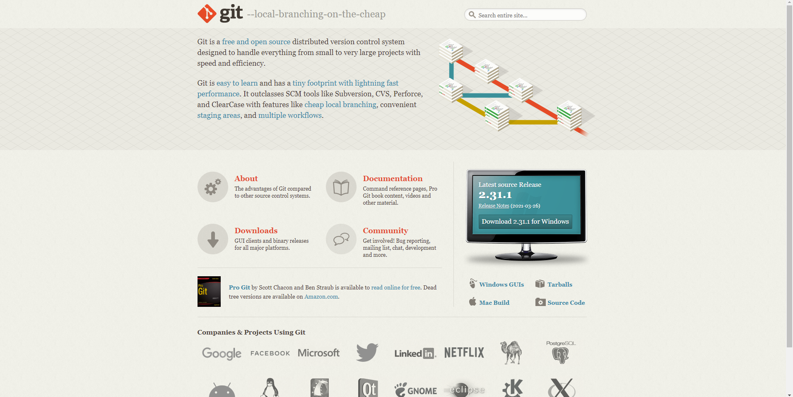

<h2 align="center">Learning Git/GitHub</h2>

  
   </a>
    
  </a>
  
  
    
  </a>
  
  </a>
    
  </a>
  
  </a>
    
  </a>
  
   </a>
    
 
  
  
  

  

## ¿Que es Git?
es un software de control de versiones diseñado por Linus Torvalds, pensando en la eficiencia y la confiabilidad del mantenimiento de versiones de aplicaciones cuando éstas tienen un gran número de archivos de código fuente. Su propósito es llevar registro de los cambios en archivos de computadora y coordinar el trabajo que varias personas realizan sobre archivos compartidos. [WIKIPEDIA](https://es.wikipedia.org/wiki/Git). 

## #Tabla de contenidos

| Numeration   | Check  |    Topic      |   Quantization   |    Edit Gitpot    |    Downloads    |  link  |
| ------------ |--------|-------------- |----------------- |------------------ |---------------- |-------- |
|  001   |:heavy_check_mark: | [Instalacion](#Instalacion)   | :hourglass:     | 💻 | 💾 | [ ⬅️ Atras](https://github.com/BrianMarquez3)| 
|  002   |:heavy_check_mark: | [Comandos](#Comandos)   | :hourglass:     | 💻 | 💾 | [ ⬅️ Atras](https://github.com/BrianMarquez3)| 
|  003   |:heavy_check_mark: | [Crear repositorio](#Crear-repositorio)   | :hourglass:     | 💻 | 💾 |[ ⬅️ Atras](https://github.com/BrianMarquez3) | 
|  004   |:heavy_check_mark: | [Principales Comandos](#Principales-Comandos)   | :hourglass:     | 💻 | 💾 |[ ⬅️ Atras](https://github.com/BrianMarquez3) | 

---

## Comandos

Principales comando de GIT

<table>

  <tr>
    <th>NUMERO</th>
    <th>ESTADO</th>
    <th>COMANDO</th>
    <th>DESCRIPCION</th>
  </tr>

  <tr>
    <td>001</td>
    <td>✅</td>
    <td><strong>git init</strong></td>
    <td>Inicializar git, solo se ejecuta uan ves</td>
  </tr>

  <tr>
    <td>002</td>
    <td>✅</td>
    <td><strong>git add nombreDelArchivo</strong></td>
    <td>Se consigue llevar el Archivo de repositorio local al area de ensayo(Area de Ensayo)</td>
  </tr>

  <tr>
    <td>003</td>
    <td>✅</td>
    <td><strong>git commit -m "NombreDelCambio"</strong></td>
    <td>Trasladar el archivo al area de rep. local</td>
  </tr>

  <tr>
    <td>004</td>
    <td>✅</td>
    <td><strong>git status </strong></td>
    <td>Archivos Pendindites</td>
  </tr>

  <tr>
    <td>005</td>
    <td>✅</td>
    <td><strong>git log --oneline </strong></td>
    <td>Historial de Cambios</td>
  </tr>  

  <tr>
    <td>006</td>
    <td>✅</td>
    <td><strong>it reset --hard numeroDeCommit </strong></td>
    <td>Hacer una restauracion a la version Anterior</td>
  </tr>   

  <tr>
    <td>007</td>
    <td>✅</td>
    <td><strong>git add . </strong></td>
    <td>Agregar todo al areas de ensayo</td>
  </tr>  

  <tr>
    <td>008</td>
    <td>✅</td>
    <td><strong>git commit -am "Comentario" </strong></td>
    <td>hace add y commit juntos</td>
  </tr>    
  
  <tr>
    <td>009</td>
    <td>✅</td>
    <td><strong>git commit -ammend </strong></td>
    <td>Complejo Editor en este caso lo utilizaremos para modificar </td>
  </tr>    
  

---
## Instalacion

<table>

Instalacion de Git en Windows

  <tr>
    <td align="center" style="padding=0;width=50%;">
      
    </td>
  </tr>
</table>

📦 [Install Git](https://git-scm.com/) Instalador de Git. 
📦 [Install Github](https://desktop.github.com/) Instalador de Github. 

## Crear repositorio

| Carpeta                    | Link |    Home   |  Code       | Version      | Estado     |
|----------------------------|:-----------:|:-----------:|:-----------:|:-----------:|:-----------:|
| [Crear repositorio](https://github.com/BrianMarquez3/C-Plus-Plus-Course/tree/master/Busqueda%20Binaia)          |      ✔️     |  [⬅️Atras](#Tabla-de-contenidos) | yes | yes | ✔️ |

## Principales Comandos

<table>

Instalacion de Git en Windows

  <tr>
    <td align="center" style="padding=0;width=50%;">
      
    </td>
  </tr>
</table>

| Carpeta                    | Link |    Home   |  Code       | Version      | Estado     |
|----------------------------|:-----------:|:-----------:|:-----------:|:-----------:|:-----------:|
| [Principales Comandos](https://github.com/BrianMarquez3/Learning-Git#Principales-Comandos) | yes | yes | ✔️ |

## Book

📦 [Descargar Libro de Git](https://git-scm.com/book/en/v2) Descargar Book

